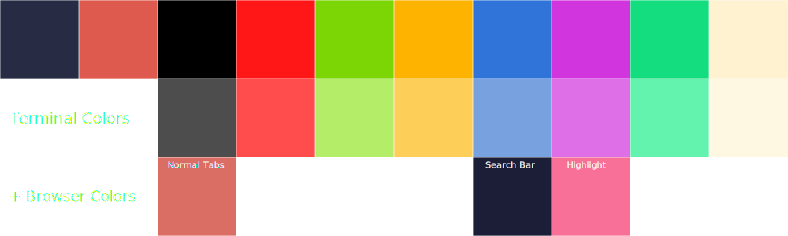

# Ocean Breeze

This config is aiming to be a "lighter dark theme" and has a lot of blue, orange and yellow.

## Notes

Please move the ocean-breeze.zsh-theme to your ~/.oh-my-zsh/custom/themes.
The theme is just agnoster with the colors adjusted to match. So full credit to the creators of that theme.

This theme also includes all files needed to customize Firefox to fit the theme.
You will need to symlink the `.config/userChrome` to your Firefox `chrome` dir.
The browser extensions you will need are: [Sidebery](https://addons.mozilla.org/en-US/firefox/addon/sidebery/) & [Tabliss](https://addons.mozilla.org/en-US/firefox/addon/tabliss/)

This theme looks great with [catppuccin cursors](https://github.com/catppuccin/cursors). I personally use the Mocha Dark ones. (currently)

This theme is still somewhat WIP. (hence no nvim config)
There is an issue with spotify_player displaying the wrong song as currently playing this is (as far as I can tell) not an issue with
the config itself.
